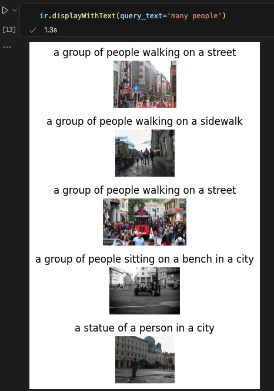

# Azure_Vision_ImageRetrieval

This repository aims at giving sample code for vector search with [Azure Computer Vision Image retrieval API](https://learn.microsoft.com/en-us/azure/ai-services/computer-vision/how-to/image-retrieval) and `faiss`.

Other reference:
- [Revolutionizing Image Search with Vectors](https://learn.microsoft.com/en-us/shows/ai-show/revolutionizing-image-search-with-vectors)
- [What is Azure AI Vision?](https://learn.microsoft.com/en-us/azure/ai-services/computer-vision/overview)

# How to use

- Environmental setting
    - `python` libraries:
    ```sh
    pip install -r ./requirements.txt
    ```

- API assumption
    - Prepare [Flickr](https://www.flickr.com/) account, where we can get several image under creative commons license.
    - Prepare [Azure Computer vision API](https://learn.microsoft.com/en-us/azure/ai-services/computer-vision/overview-image-analysis?tabs=4-0)

- Configuration
    You need to prepare the `config.yml` file for configuration. Once you put values, please allocate it in the top directory of the repository:

    ```yml
        ## Flickr account
        flickr:
            API_KEY: <YOUR API KEY>
            API_SECRET: <YOUR API SECRET>
            NUMBER_OF_IMAGES: 100 ## How many images do you use?
            NUMBER_PROCESS_IMAGES: 10  ## Prepare for test

        image:
            folder: './downloaded_images'

        Azure:
            KEY: <YOUR API KEY FOR AZURE COMPUTER VISION>
            ENDPOINT: 'https://<YOUR CV RESOURCE NAME>.cognitiveservices.azure.com'

        faiss:
            dimension: 1024
            filename: 'imageIndex.pkl'
            top_N: 5 ## How many you use 

        meta_data:
            vectors_name: 'vectors.pkl'

        display:
            num_cols: 1 ## How many columns in displaying the result?
    ```

- Run the codes!
    - If you succeed in running the [notebook](./notebook/how-to-use.ipynb), you get the following result in the end.
        - 
        - Here are quick summary of the procedures:
            - Get several images in Flickr.
            - For the downloaded images, we append vector with `vectorizeImage` API.
            - Store the vectors in `faiss`, where we can query images after converting text or image into vector. 
            - We put `many people` as argument of `query_text` of the method `displayWithText`. Then, the text is converted into vector with `vectorizeText` API, and it's used for searching pre-stored images.

# Note: Environment setup

- [API refrence for azure-ai-vision](https://learn.microsoft.com/en-us/python/api/azure-ai-vision/?view=azure-python-preview)
- If python doesn't see the package, try: `!pip show`
    - Then, add the path as follows: `sys.path.append('/anaconda/envs/azureml_py38/lib/python3.8/site-packages')`